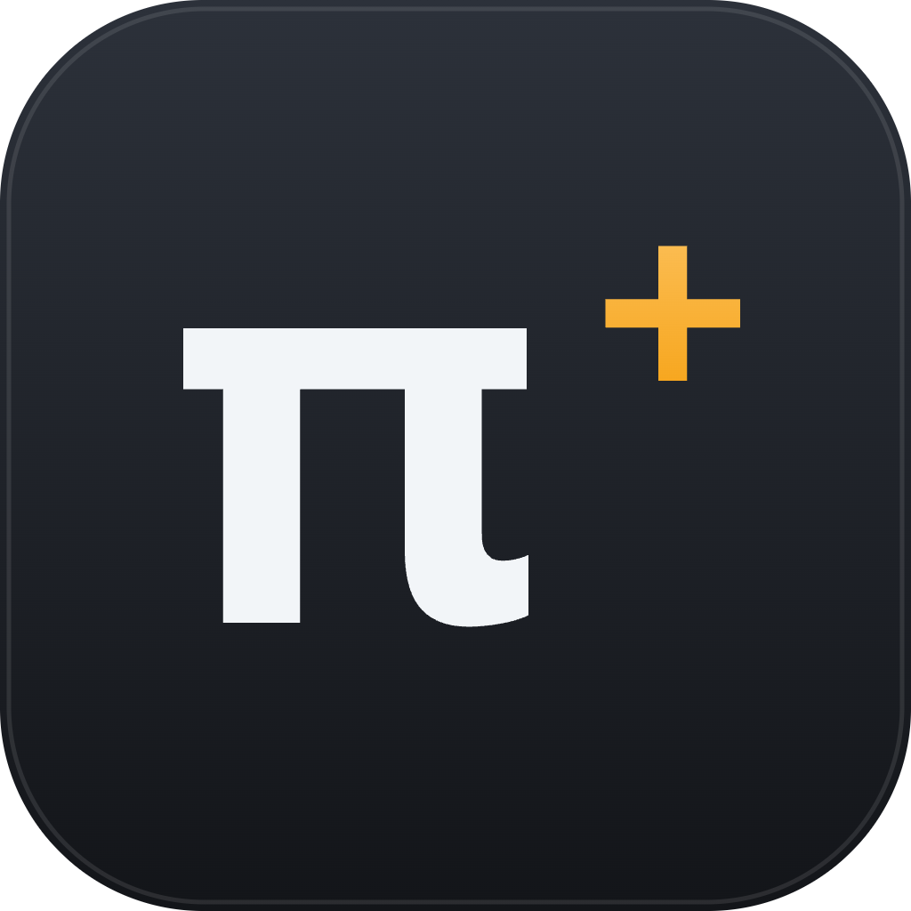
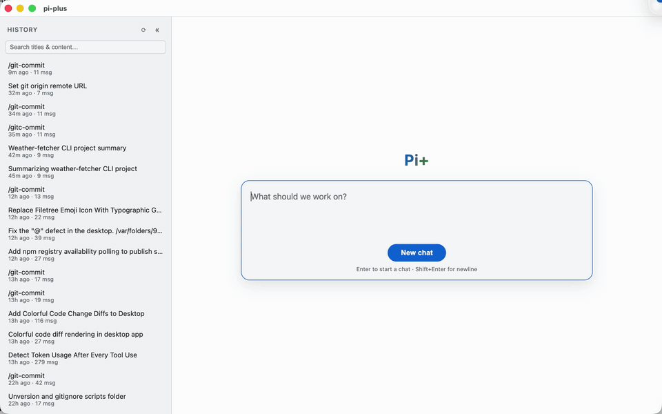

<div align="center">
  
  <h1>pi-plus-desktop</h1>
  <p>Desktop app for <a href="https://github.com/pi-plus-org/pi-plus">pi-plus</a> — multi-tab AI agent sessions with profile management, built on Electron and embedding <code>pi-plus-sdk</code> directly in the main process (no CLI subprocess).</p>
  <p>
    <a href="https://github.com/pi-plus-org/pi-plus-desktop/releases/latest"></a>
  </p>
  
</div>

## Installation

1. **Download** the package for your platform from the [GitHub releases page](https://github.com/pi-plus-org/pi-plus-desktop/releases/latest):
   - **macOS**: `Pi+-<version>.dmg` — open it and drag **Pi+** into `/Applications`. The build is ad-hoc signed and not notarized, so on first launch use **right-click → Open** (or allow it under System Settings → Privacy & Security).
   - **Windows (x64)**: `Pi+-<version>-win-x64.msi` — run the installer (accept the UAC prompt): it installs to `C:\Program Files\Pi+` and adds a Start-menu shortcut; uninstall via Settings → Apps. New versions replace the old one in place. The build is unsigned, so SmartScreen may intervene on first run — **More info → Run anyway**.
2. **Authenticate** — pick any of: add a provider token under Settings → Profiles, log in with the pi CLI, or export an API key. Pi+ uses the same `~/.pi/agent` directory as the pi CLI and creates it on first use; an existing setup (and its sessions and profiles) is picked up as-is. On Windows that's `%USERPROFILE%\.pi\agent`.

## Usage

### Starting a chat

On launch you land on the **Pi+** screen — type what you want to work on and press Enter (or click **New chat**, or press ⌘N/Ctrl+N anywhere). The first chat asks for a **working folder**: the session's CWD is where the agent reads and edits files. Every tab is one agent session; the + button at the end of the tab bar opens another, and tabs are switched with ⌘⇧[ / ⌘⇧] (Ctrl on Windows/Linux). Drafts and pending attachments are kept per-tab and park/restore as you switch.

### The chat box

- The rounded 3-line input takes long drafts (they scroll inside); **Enter** sends, **Shift+Enter** is a newline, **Esc** stops the agent while it streams.
- **Paperclip** — attach files or folder paths to your message.
- **⋯ menu** — per-session capabilities: rename, clone (branch with full history), change folder (`/cd`), fork from message, rewind, and create/improve `AGENTS.md` (`/init`).
- **✎** — round-trip the draft through your external editor (also ⌘⌥E / Ctrl+Alt+E).
- **`/`** — typing a slash at line start pops the session-executable commands (extension commands, prompt templates, skills) with arrow-key selection.
- **Steering** — sending while the agent is still working queues the message as *steer* (redirect now) or *follow-up* (run after); the "⇢ next: …" chip in the status strip toggles the mode, ✕ clears the queue.

### Status strip & tool output

Above the chat box the status strip carries the model & thinking-level pickers (the model list is scoped to the tab's profile), a skills popover, manual compact (abortable), the queue chip, the last exchange's usage & cost, and a right-aligned context-usage gauge. In the transcript, thinking blocks and tool executions are collapsible rows — file edits render as colorful diffs, bash runs show their output.

### History sidebar (left)

All past sessions, newest first, with a search box matching titles and full transcript content. **⌘B** toggles the panel, **⌘R** (or the header ⟳) reloads it. Click a row to resume the session in a new tab — or to activate the tab if it's already open. Drag the panel's right edge to resize (double-click restores the default width); the width is persisted. Transcripts are not deletable from the UI.

### File tree (right)

The active session's working folder as a lazy tree. Agent edits appear automatically; click a row to select it, then **⌂** reveals that file/folder in Finder/Explorer (with nothing selected it reveals the working folder itself). Toggle with **View → Toggle File Tree** (⌘⌥B / Ctrl+Alt+B); the panel is drag-resizable and hides itself when no tab is open.

### Profiles & settings

Profiles (model/provider credentials, in `~/.pi/profiles.json`, materialized to isolated agent dirs like the `pipi` CLI's) are managed from the native app menu; each tab shows its profile as a badge. **⌘,** opens Settings: **Editors** (picker of installed blocking-GUI editors for the ✎ button), **Compaction** (auto-compact on/off, compact-at threshold, context floor and window cap — the same controls as the TUI `/settings`). Light & dark themes follow the system by default, with a manual override under **View → Theme**.

### Shortcuts

| | macOS | Windows/Linux |
| --- | --- | --- |
| New chat | ⌘N | Ctrl+N |
| Close tab | ⌘W | Ctrl+W |
| Previous / next tab | ⌘⇧[ / ⌘⇧] | Ctrl+Shift+[ / ] |
| Toggle history sidebar | ⌘B | Ctrl+B |
| Reload history list | ⌘R | Ctrl+R |
| Toggle file tree | ⌘⌥B | Ctrl+Alt+B |
| Edit draft in external editor | ⌘⌥E | Ctrl+Alt+E |
| Settings | ⌘, | Ctrl+, |
| Stop the agent | Esc | Esc |

Every button that has a shortcut shows the chord in its hover tooltip.

## Features

- **Multiple tabs**, one agent session per tab
- **Session history sidebar** managed through SDK APIs (`SessionManager.listAll` / `search` / `deleteSession`): flat list ordered by last activity (newest first), a search box matching titles and full transcript content via the SDK, streaming indicator per open session, the active tab's session highlighted, click activates an already-open tab (or resumes into a new one); transcripts are not deletable from the UI; drag the panel's right edge to resize it (double-click restores the default; the width is persisted), reload the list with the header ⟳ button or ⌘R/Ctrl+R, and hide or show it with the header « button or ⌘B/Ctrl+B (hidden, only a » button remains at the window's edge)
- **Profile management** delegated to `pi-plus-sdk`'s pi-hub profile API (profiles in `~/.pi/profiles.json`), via the native app menu and a per-tab profile badge
- Full streaming chat UI: markdown rendering, collapsible thinking blocks, tool execution rows, compaction and retry notices
- **Session capabilities** per tab, driven by SDK APIs — a "⋯" menu right of the paperclip in the composer: rename, clone (in-place branch with full history), change folder (`/cd`), fork from message, rewind, create/improve `AGENTS.md` (`/init`)
- **Chat box**: a fixed 3-line rounded input (long drafts scroll inside) whose bottom strip carries the paperclip, the "⋯" session menu and the ✎ external-editor button on the left and a round Send (↑, Esc = Stop while streaming) on the right; the chatbox and its status line are per-tab — drafts and pending attachments park and restore as you switch tabs
- **Composer status strip** (above the chat box): model & thinking-level pickers (the model list is scoped to the tab's profile models), skills popover (click to insert `/skill:name`), manual compact with abort-while-compacting, the send-mode/queue chip, the last exchange's usage & cost, and a right-aligned context-usage gauge
- **Slash-command menu**: typing `/` at the start of a line pops the session-executable commands (extension commands, prompt templates, skills) with arrow-key selection, like the TUI
- **Steering queue**: sending while the agent streams queues the message as steer or follow-up — the "⇢ next: …" chip in the status strip toggles the mode and ✕ clears the queue
- **Compaction settings** under Settings (⌘,) → Compaction: auto-compact on/off (default profile's agent dir, shared with pipi), compact-at threshold, context floor and context-window cap — same controls as the TUI `/settings`
- **External editor** for the chat draft: the ✎ button in the chat box's bottom strip (also ⌘⌥E / Ctrl+Alt+E) round-trips the draft through an external editor; Settings (⌘,) → Editors is a picker of installed blocking-GUI editors (VS Code, Sublime, Zed, …, probed on PATH plus `/usr/local/bin` and `/opt/homebrew/bin`, since Finder/Dock launches get a minimal PATH), stored as absolute commands and re-resolved at spawn — terminal editors have no TTY here
- **Pinned chrome**: tab bar, composer status strip and input row never move — only the message area and the history list scroll, each independently
- **Tab & panel shortcuts** (⌘ on macOS, Ctrl elsewhere): ⌘N (or the ⌘T alias, or the + button — sits right after the last tab, pinned to the bar's right edge when the tabs overflow) for a new chat/tab, ⌘W close tab (on other windows, e.g. Settings, ⌘W closes the window; ⌘⇧W always closes the main window), ⌘⇧[ / ⌘⇧] cycle tabs, ⌘B toggle the history panel, ⌘R reload the history list, ⌘⌥E edit the draft in the external editor, ⌘, settings — buttons that have a shortcut show it in their hover tooltip
- Light & dark themes, following the system appearance by default, with a manual override under View → Theme (persisted across launches)

## Development

Everything below is for hacking on the app itself — to just use Pi+, install a release from the section above.

### Requirements

- Node.js ≥ 22.19 (Electron 39 ships Node 22.20)
- Provider auth (any source the SDK accepts — `~/.pi/agent` is created automatically if absent)

### Setup

`pi-plus-sdk` is consumed from the local [pi](https://github.com/earendil-works/pi)
monorepo as a `file:` dependency (`../pi/packages/plus-api/dist/npm`, installed as a
symlink) — so a checkout of pi next to this repo is required, and the npm registry is
never consulted for pi-plus artifacts. Build the staging tree first:

```sh
.claude/scripts/sync-pi-local.sh --no-test   # ../pi: build + SDK sync
npm install
```

If the Electron binary download times out on your network:

```sh
ELECTRON_MIRROR=https://npmmirror.com/mirrors/electron/ npm install
```

### Local SDK development

```sh
.claude/scripts/sync-pi-local.sh             # full loop: build + sync + tests
.claude/scripts/sync-pi-local.sh --fast      # skip monorepo build:offline (reuse dist/)
.claude/scripts/sync-pi-local.sh --sdk-only  # skip the plus-cli artifact build + tests
.claude/scripts/sync-pi-local.sh --no-test   # build + sync only
```

The script builds `pi-plus-sdk` from `../pi`, and the app picks it up live through the
symlink (rebuild only when `pi-plus-sdk`'s own dependencies change → re-run `npm install`).
It also builds the `pi-plus` CLI staging tree; refreshing the global `pipi` is manual:
`npm install -g ../pi/packages/plus-cli/dist/npm`. See `CLAUDE.md` for details.

To go back to the published SDK (e.g. to pack a distributable DMG), the inverse script
detaches the local link and installs from the registry — `sync-pi-local.sh` re-links afterwards:

```sh
.claude/scripts/unlink-pi-local.sh        # latest registry version; or: unlink-pi-local.sh 0.1.3
```

### Run

```sh
npm run dev     # esbuild watch + electron with reload on rebuild
npm run build   # production bundles in dist/
npm start       # run the built app
npm run typecheck
```

### Smoke test

Verifies the SDK embedding without Electron (creates a runtime in a temp dir, sends a prompt, asserts a reply, then round-trips clone-in-place and `/cd` relocation):

```sh
node scripts/smoke.mjs [provider]
```

Defaults to the `kimi-coding` provider. Exits with `SKIP` when no model/auth is configured.

### App icon

The icon is authored as `assets/icon.svg` (π + amber plus on a dark rounded square).
Rasterize and rebuild the platform icon files after editing it:

```sh
npm run icon   # renders assets/icon.svg → assets/icon.png via headless Electron,
               # then packs assets/icon.ico (16/32/48/256 px, for the Windows MSI)
```

Then regenerate `assets/icon.icns` with `sips`/`iconutil` (see the loop in git history or `devops/scripts/pack-macos.sh`, which consumes the `.icns`). The `.ico` is consumed by `devops/scripts/win-wxs.mjs` for the MSI's Add/Remove-Programs entry and Start-menu shortcut.

The README hero image is `assets/demo.gif`: recorded from a real session, cropped to the window and encoded with ffmpeg (`crop → scale=960 → fps=15 → palettegen/paletteuse`). To recreate, record the app window region and cut the segment from prompt-typing through the completed reply.

### Packaging (macOS)

`devops/scripts/pack-macos.sh` builds a distributable with the project's own Electron binary — no extra tooling:

```sh
devops/scripts/pack-macos.sh        # → release/Pi+-<version>.dmg
```

It production-builds the bundles, assembles `Pi+.app` (Electron framework, app payload with production-only `node_modules` from `npm ci --omit=dev`, `Info.plist`, `icon.icns`), ad-hoc re-signs the bundle (required — the upstream Electron signature is invalidated by the modifications), and wraps it in a drag-to-install UDZO DMG. The `.app` exists only as transient staging (`dist/pack/`, removed afterwards); `release/*.dmg` is the sole artifact. Gatekeeper: an ad-hoc signed app opens locally but is not notarized; for distribution, re-sign with a Developer ID and notarize.

To install into `/Applications`, `.claude/scripts/deploy-pack.sh` builds the package itself and picks the mechanism automatically — no flags needed:

```sh
.claude/scripts/deploy-pack.sh          # auto: dev symlink install while the tree has
                                        # file:/symlinked deps, else DMG build + deploy
.claude/scripts/deploy-pack.sh --dev    # force the symlink mechanism
.claude/scripts/deploy-pack.sh --regular # force DMG: runs pack-macos.sh, then deploys it
.claude/scripts/deploy-pack.sh --keep   # DMG path: leave release/*.dmg in place
```

The dev install assembles `Pi+.app` from this working tree with `Resources/app/{dist,node_modules}` symlinked back into the repo — relaunching always runs the freshest `dist/` and `../pi` SDK builds, but the checkout (and `../pi`) must stay in place. The DMG path builds a fresh pack via `devops/scripts/pack-macos.sh` (which refuses while `file:` dependencies are present), mounts it read-only, quits a running instance, `ditto`s `Pi+.app` into `/Applications`, verifies the code signature, and deletes the DMG afterwards (unless `--keep`). For a distributable DMG, run `.claude/scripts/unlink-pi-local.sh` first (registry spec restored), pack, then `sync-pi-local.sh` to switch back.

### Packaging (Windows)

`devops/scripts/pack-windows.sh` cross-packs a per-machine x64 MSI on macOS (no Windows host or wine). It needs the [msitools](https://github.com/GNOME/msitools) linker: `brew install msitools`.

```sh
devops/scripts/pack-windows.sh        # → release/Pi+-<version>-win-x64.msi
```

It fetches and SHA256-verifies the official Electron win32-x64 distribution (cached in `.pack-cache/`), assembles the same app payload as the macOS pack (`npm ci --omit=dev --os=win32 --cpu=x64 --ignore-scripts`, Windows esbuild binaries verified), prunes darwin-only leftovers (`.bin` shims, AppleDouble files), then `devops/scripts/win-wxs.mjs` harvests the staged tree into one WiX document — a component per directory with deterministic GUIDs — and `wixl` links it into an MSI with a single embedded MSZIP cabinet. Installing requires elevation; a new version replaces the previous install (fixed UpgradeCode, `MajorUpgrade`), and uninstall goes through Settings → Apps. Unsigned like the DMG: SmartScreen may show a "More info → Run anyway" prompt on first run. `devops/scripts/publish-github.sh` runs both packs and attaches the `.dmg` + `.msi` to the GitHub release.

## Notes

- **Default model**: the app uses whatever model the SDK selects from `~/.pi/agent/settings.json` (`defaultProvider`/`defaultModel`). If that model's provider isn't authenticated, session creation still succeeds but prompts fail — set a working default in `settings.json` or via a profile.
- **Profiles** live in `~/.pi/profiles.json` and are materialized to isolated agent dirs under `~/.pi/pi-hub/profiles/<name>/` (auth, settings, models, with shared extensions/skills/sessions symlinked) by the SDK's bundled pi-hub implementation — identical to what the `pipi` CLI does.
- Sessions are persisted by the SDK as JSONL under `~/.pi/agent/sessions/<cwd>/`, so desktop sessions also appear in the pi CLI and vice versa.
- **Auto-compaction** is a global setting in the profile's agent-dir `settings.json` — toggling it in a tab also affects `pipi` CLI sessions sharing that dir.
- **Change folder (/cd)** re-parents the session: the transcript is relocated to the new cwd's default session dir and the old file is removed (the session itself continues with full history).
- Run only one instance at a time: all instances share the Electron user-data dir.
